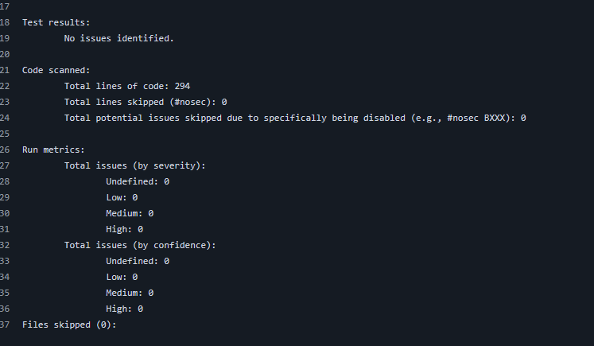
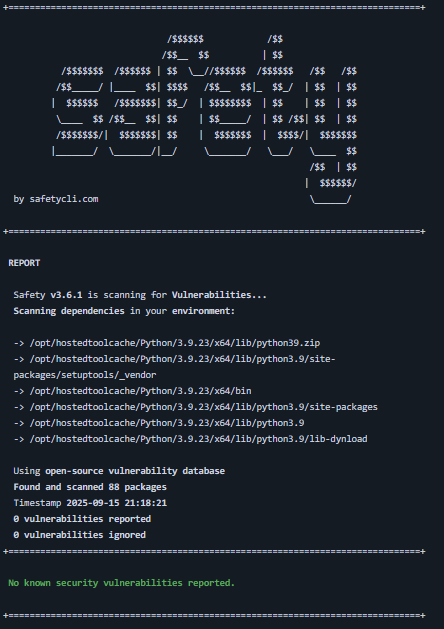

# information-security-lab-1
Разработка безпасного backend приложения с автоматизированной проверкой кода на уязвимости.

Отлично! Создам comprehensive README.md для вашего проекта. Вот полная документация:

## API Endpoints

### 1. Аутентификация

**POST /auth/login** - Аутентификация пользователя
```bash
curl -X POST http://localhost:5000/auth/login \
  -H "Content-Type: application/json" \
  -d '{"username":"admin","password":"admin123"}'
```

**Response:**
```json
{
  "access_token": "eyJhbGciOiJIUzI1NiIs...",
  "refresh_token": "eyJhbGciOiJIUzI1NiIs...",
  "token_type": "bearer",
  "expires_in": 900,
  "user": {
    "username": "admin",
    "role": "admin",
    "user_id": 1
  }
}
```

### 2. Профиль пользователя

**GET /api/profile** - Получение профиля (требует аутентификации)
```bash
curl -X GET http://localhost:5000/api/profile \
  -H "Authorization: Bearer YOUR_ACCESS_TOKEN"
```

**Response:**
```json
{
  "id": 1,
  "username": "admin",
  "role": "admin",
  "created_at": "2024-01-15T10:30:00"
}
```

## 🔒 Реализованные меры защиты

### 1. Защита от SQL Injection (SQLi)

**Технология:** SQLAlchemy ORM + параметризованные запросы

**Реализация:**
- Использование SQLAlchemy ORM вместо raw SQL
- Автоматическая параметризация всех запросов
- Валидация входных данных на уровне моделей
- Check constraints в базе данных

**Код:**
```python
# Безопасные запросы через ORM
user = User.query.filter_by(username=username).first()
```

### 2. Защита от XSS (Cross-Site Scripting)

**Технология:** HTML escaping + санитизация вывода

**Реализация:**
- Экранирование всех пользовательских данных в ответах API
- Санитизация входных данных
- Security headers (CSP, X-XSS-Protection)

**Код:**
```python
def sanitize_output(data):
    if isinstance(data, str):
        return html.escape(data)
    elif isinstance(data, dict):
        return {k: sanitize_output(v) for k, v in data.items()}
    return data
```

### 3. Безопасная аутентификация

**Технология:** JWT + bcrypt + refresh tokens

**Реализация:**
- **Хэширование паролей:** bcrypt с salt (12 раундов)
- **JWT токены:** Access (15 мин) + Refresh (7 дней)
- **Token blacklist:** Механизм logout и отзыва токенов
- **Защита от timing attacks:** Постоянное время проверки паролей

**Код:**
```python
# Хэширование паролей
def set_password(self, password):
    self.password_hash = bcrypt.hashpw(password.encode('utf-8'), bcrypt.gensalt())

# Проверка пароля
def check_password(self, password):
    return bcrypt.checkpw(password.encode('utf-8'), self.password_hash.encode('utf-8'))
```

## 📊 CI/CD Pipeline & Security Scanning


### Bandit SAST Report


### Safety Report

